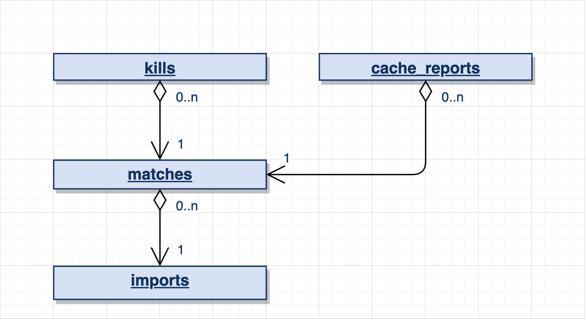

# README

Este projeto realiza o parsing de arquivos de log do Quake.

### Dependências

* Ruby: 3.3.0
* Rails: 7.1.3.2
* PostgreSQL: 15.4
* Redis: 7.2

### Setup

* `bin/rails db:setup`
* `bundle`

### Execução dos testes

* `rspec`

### Execução do sistema

* `bin/rails s`
* `bundle exec rake solid_queue:start`

Após iniciar o sistema, acesse http://localhost:3000 e faça o upload de um arquivo de log do Quake para que ele possa ser processado.

### 1. Arquitetura

Tendo em vista a simplicidade do problema apresentado, um pequeno script poderia ter sido desenvolvido para a conclusão da tarefa. Algo similar ao que foi desevolvido em [app/services/parser.rb](https://github.com/cristianocasm/log_parser/blob/main/app/services/parser.rb) já seria suficiente para realizar o parsing [dos logs do Quake](https://gist.githubusercontent.com/cloudwalk-tests/be1b636e58abff14088c8b5309f575d8/raw/df6ef4a9c0b326ce3760233ef24ae8bfa8e33940/qgames.log) e apresentar os relatórios solicitados.

Apesar disso, decidi considerar um cenário um pouco mais complexo para que eu pudesse demonstrar mais meu conhecimento. Desse modo, o sistema criado tem por objetivo fazer o parsing de qualquer log do Quake - a partir de uma interface web.

Neste contexto, algumas decisões arquiteturais foram tomadas conforme disposto nas próximas secões.

#### 1.1. *ActiveStorage*

Utilizei o ActiveStorage para gerenciar os arquivos enviados para o sistema.

Sua utilização facilitou o **controle de duplicidade de arquivos** graças ao controle que ele mantém sobre o *checksum* do documento - veja [esta LOC](https://github.com/cristianocasm/log_parser/blob/main/app/models/concerns/has_one_unique_attached_log_file.rb#L7) para mais detalhes de implementação.

Além disso, no ambiente de produção, [uma simples configuração faria com que os arquivos fossem enviados diretamente para alguma cloud](https://guides.rubyonrails.org/active_storage_overview.html#s3-service-amazon-s3-and-s3-compatible-apis). **Essa interação seria ideal, pois traria benefícios tais como a diminuição da carga no servidor web (principalmente para arquivos maiores), melhoraria do desempenho (já que o arquivo iria direto para seu destino final - i.e., a cloud), entre outros**.

#### 1.2. *SolidQueue*

Utilizei o *SolidQueue* para realizar o parsing dos logs em *background*. Essa abordagem traz uma série de benefícios tais como **remoção de carga do servidor web, monitores de execução de jobs e reexecução automática caso ocorra uma falha**.

Note que o último benefício descrito acima (i.e., reexecução automática) pode se tornar um problema caso a falha ocorra após a persistência de algum dado no banco. Pensando nisso, **utilizei uma *transaction* para garantir a [atomicidade](https://en.wikipedia.org/wiki/Atomicity_(database_systems)) das operações**. Veja [esta LOC](https://github.com/cristianocasm/log_parser/blob/main/app/services/parser.rb#L14) para mais detalhes.

Vale mencionar também uma outra decisão tomada que, apesar de simples, poderia evitar dores de cabeça: não carrego todo o arquivo para a RAM durante o parsing. Ao contrário, vou lendo o arquivo linha por linha para trazer para a RAM somente o que é necessário naquele momento. Veja [esta LOC](https://github.com/cristianocasm/log_parser/blob/main/app/services/parser.rb#L16) para mais detalhes.

#### 1.3. Modelagem de dados

O banco de dados foi modelado conforme o esquema abaixo.

As tabelas `kills`, `matches` e `imports` são versões [normalizadas](https://en.wikipedia.org/wiki/Database_normalization) para a persistência dos dados.

Já a tabela `cache_reports` funciona como uma espécie de *cache* - armazenando os dados processados que compõem os relatórios. Essa abordagem remove carga do banco tendo em vista que os dados já estão processados e precisam ser apenas exibidos quando o usuário acessar a página de relatórios.

#### 1.4. *Hotwire*

Este projeto se baseia no conceito do [Hotwire](https://hotwired.dev/), utilizando o [Turbo](https://turbo.hotwired.dev/) para prover dinamicidade ao front-end sem a utilização de JS.

Após realizar o upload do arquivo de log, a página atualiza o status do processamento e exibe o relatório para o usuário ao final - sem utilizar JS explicitamente! Veja como esse processo ocorre no GIF abaixo:

